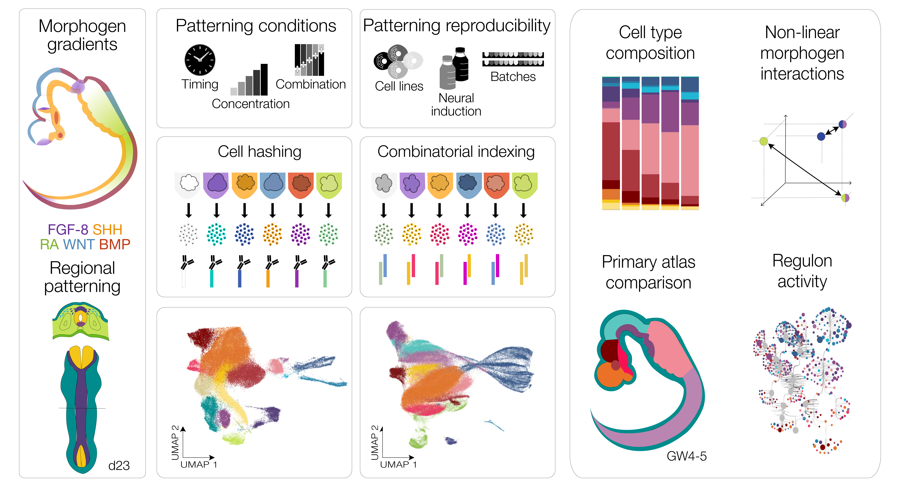

# Systematic scRNA-seq screens profile neural organoid response to morphogens


Repository conitaning code used for the analysis in the [Sanchís-Calleja, Azbukina et al., 2025](https://www.nature.com/articles/s41592-025-02927-5).
Repo has 4 folders, dedicated to morphogen patterning screen, morphogen reproducibility screen, morphoGRN analysis with SCENIC, and MiSTR.





```bibtex
@article{sanchis-calleja2025systematic,
  author  = {Sanch{\'\i}s-Calleja, F{\'a}tima and Azbukina, Nadezhda and Jain, Akanksha and He, Zhisong and Okamoto, Ryoko and Rusimbi, Charlotte and Rifes, Pedro and Rathore, Gaurav Singh and Santel, Malgorzata and Janssens, Jasper and Seimiya, Makiko and Eisinger, Benedikt and Fleck, Jonas Simon and Kirkeby, Agnete and Camp, J. Gray and Treutlein, Barbara and others},
  title   = {Systematic scRNA-seq screens profile neural organoid response to morphogens},
  journal = {Nature Methods},
  year    = {2025},
  doi     = {10.1038/s41592-025-02927-5},
  note    = {Published 15 December 2025, open access}  
}


```
